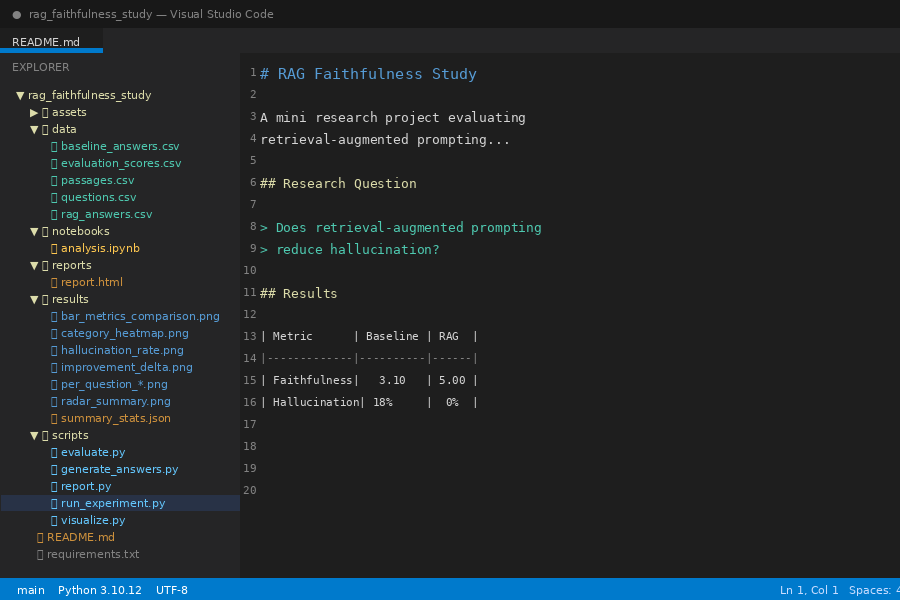
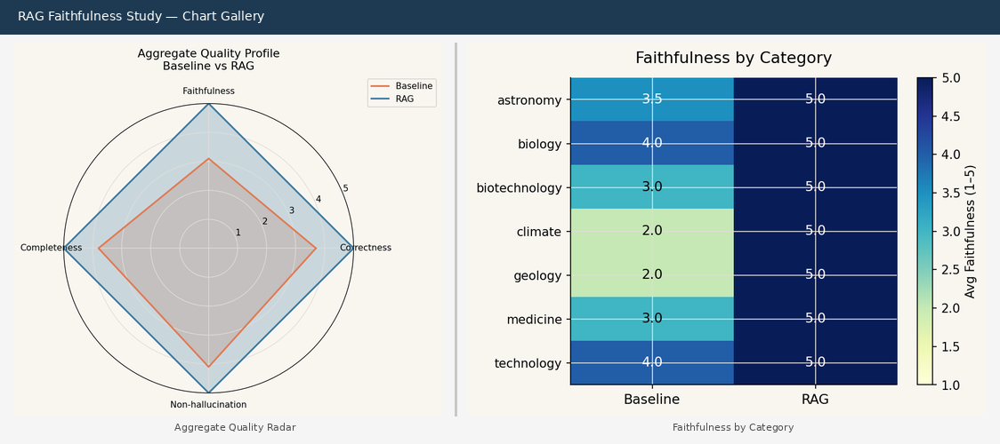
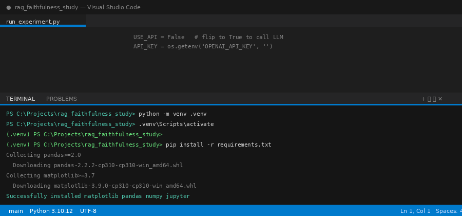
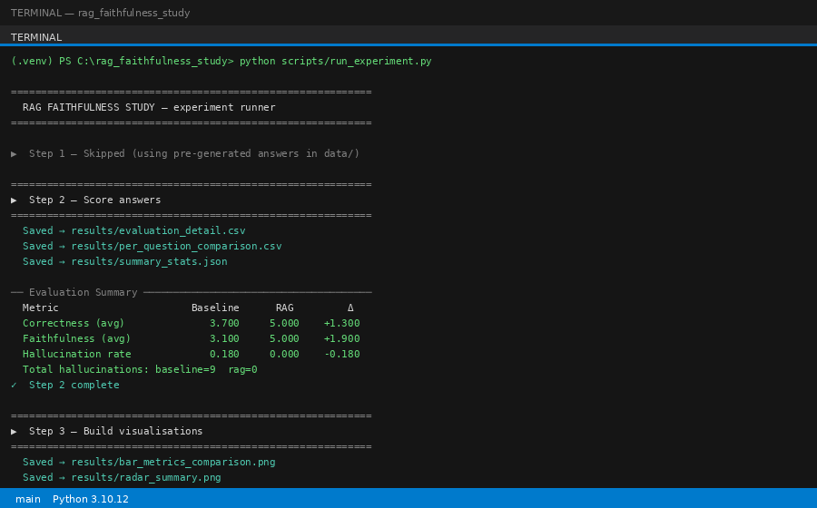
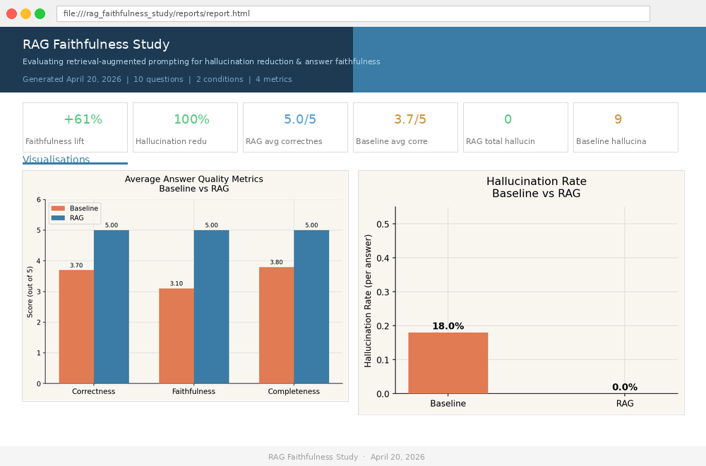
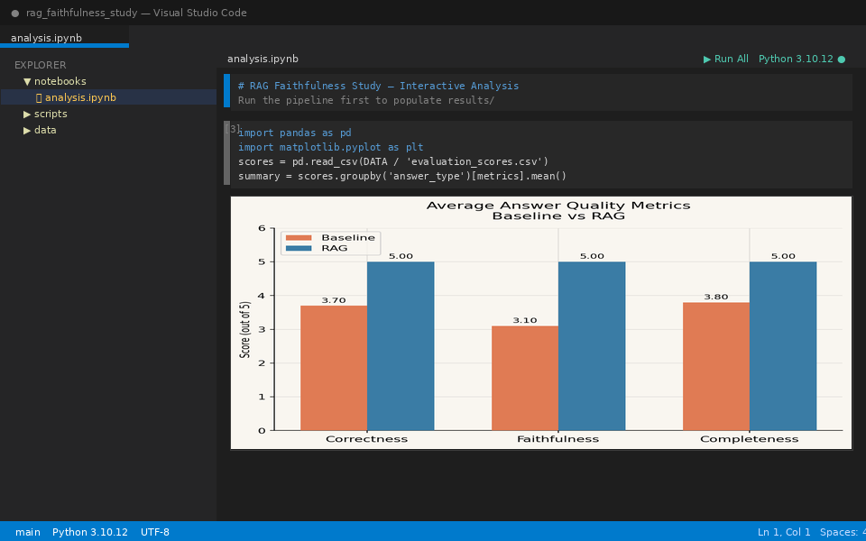
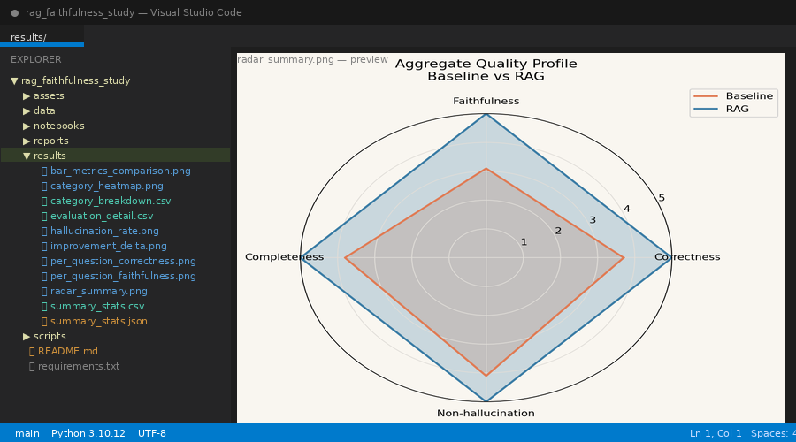

# RAG Faithfulness Study

A mini research project evaluating whether retrieval-augmented prompting improves answer
faithfulness and reduces hallucination in question-answering tasks.



---

## Research Question

> Does retrieval-augmented prompting reduce hallucination and improve faithfulness compared
> with direct prompting in a small-domain QA setting?

## Hypothesis

Providing retrieved supporting context will improve answer quality and reduce unsupported claims.

---

## Results (TL;DR)

| Metric | Baseline | RAG | Δ |
|--------|----------|-----|---|
| Correctness (avg / 5) | 3.70 | **5.00** | +1.30 |
| Faithfulness (avg / 5) | 3.10 | **5.00** | +1.90 |
| Completeness (avg / 5) | 3.80 | **5.00** | +1.20 |
| Hallucination rate | 18 % | **0 %** | −18 pp |
| Total hallucinations | 9 | **0** | — |



---

## Repository Structure

```
rag_faithfulness_study/
│
├── data/
│   ├── questions.csv           # 10 domain questions (Q01–Q10)
│   ├── passages.csv            # Reference passages for RAG retrieval
│   ├── baseline_answers.csv    # Direct-prompt answers (pre-generated)
│   ├── rag_answers.csv         # RAG answers (pre-generated)
│   └── evaluation_scores.csv   # Rubric scores + evaluator notes
│
├── scripts/
│   ├── run_experiment.py       # ← Main pipeline runner (start here)
│   ├── generate_answers.py     # Optional: call an LLM API to regenerate answers
│   ├── evaluate.py             # Score answers → results/
│   ├── visualize.py            # Build all charts → results/*.png
│   └── report.py               # Compile self-contained HTML report
│
├── notebooks/
│   └── analysis.ipynb          # Interactive exploration in Jupyter
│
├── results/                    # Generated by pipeline (git-ignored)
│   ├── evaluation_detail.csv
│   ├── per_question_comparison.csv
│   ├── summary_stats.csv / .json
│   ├── category_breakdown.csv
│   └── *.png  (7 charts)
│
├── reports/
│   └── report.html             # Self-contained research report (all charts embedded)
│
├── requirements.txt
└── README.md
```

---

## Setup & Running

### Prerequisites

- Python 3.10 or later
- VS Code with the **Python** extension installed
- (Optional) VS Code **Jupyter** extension for the notebook

---

### Step 1 — Clone / open the project

Open the `rag_faithfulness_study/` folder in VS Code:

```
File → Open Folder → select rag_faithfulness_study/
```


---

### Step 2 — Create a virtual environment

Open the VS Code integrated terminal (`Ctrl+`` ` or **Terminal → New Terminal**) and run:

```bash
# Windows
python -m venv .venv
.venv\Scripts\activate

# macOS / Linux
python3 -m venv .venv
source .venv/bin/activate
```



---

### Step 3 — Install dependencies

```bash
pip install -r requirements.txt
```

---

### Step 4 — Run the full pipeline

```bash
python scripts/run_experiment.py
```

This executes four steps in sequence:

1. **Step 1** — Skipped (uses pre-generated answers in `data/`). See below if you want to call a live LLM.
2. **Step 2** — Scores all answers and writes CSV/JSON to `results/`.
3. **Step 3** — Generates 7 charts as PNG files in `results/`.
4. **Step 4** — Compiles a self-contained `reports/report.html`.

Expected output:

```
============================================================
  RAG FAITHFULNESS STUDY — experiment runner
============================================================

▶  Step 1 — Skipped (using pre-generated answers in data/)

============================================================
▶  Step 2 — Score answers
============================================================
  Saved → results/evaluation_detail.csv
  ...
  Correctness (avg)      3.700      5.000    +1.300
  Faithfulness (avg)     3.100      5.000    +1.900
  Hallucination rate     0.180      0.000    -0.180

============================================================
▶  Step 3 — Build visualisations
============================================================
  Saved → results/bar_metrics_comparison.png
  ... (7 charts total)

============================================================
▶  Step 4 — Compile HTML report
============================================================
  Saved → reports/report.html

============================================================
  ✓  Pipeline complete!
  Results  → results/
  Report   → reports/report.html
============================================================
```



---

### Step 5 — View the report

Open `reports/report.html` in your browser. It is fully self-contained (charts embedded as
base64), so it works offline and can be shared as a single file.

```bash
# Windows
start reports/report.html

# macOS
open reports/report.html

# Linux
xdg-open reports/report.html
```

Or right-click `report.html` in VS Code Explorer → **Open with Live Server** (if you have
the Live Server extension).



---

### Optional — Regenerate answers with a live LLM

If you want to re-run the generation step using an actual language model:

1. Open `scripts/run_experiment.py` and set `USE_API = True`.
2. Open `scripts/generate_answers.py` and choose your provider and model:

```python
PROVIDER = "openai"          # or "anthropic"
MODEL    = "gpt-4o-mini"     # or "claude-3-5-haiku-20241022"
```

3. Set your API key as an environment variable:

```bash
# OpenAI
export OPENAI_API_KEY="sk-..."

# Anthropic
export ANTHROPIC_API_KEY="sk-ant-..."
```

4. Install the relevant SDK:

```bash
pip install openai       # for OpenAI
pip install anthropic    # for Anthropic
```

5. Run the pipeline as normal. The script will overwrite `data/baseline_answers.csv` and
   `data/rag_answers.csv` with freshly generated answers.

---

### Optional — Interactive notebook

Launch Jupyter from the project root:

```bash
jupyter notebook notebooks/analysis.ipynb
```

Or open `notebooks/analysis.ipynb` directly in VS Code (requires the Jupyter extension).
The notebook lets you browse individual question/answer pairs, plot custom charts, and run
correlation analyses interactively.



---

## Methodology

1. **Dataset preparation** — 10 domain questions spanning medicine, astronomy, biology,
   geology, biotechnology, climate science, and technology. Each question has a curated
   reference passage in `data/passages.csv`.

2. **Baseline condition** — Questions answered by a language model with no additional context
   (direct prompting).

3. **RAG condition** — The same questions answered with the reference passage prepended as
   context. The model is instructed to use only information from the passage.

4. **Evaluation** — Each answer scored 1–5 on four dimensions using a structured rubric:

   | Metric | Description |
   |--------|-------------|
   | **Correctness** | Factual accuracy of claims made |
   | **Faithfulness** | Degree to which answer is grounded in the passage / known facts |
   | **Completeness** | Coverage of key points in the reference passage |
   | **Hallucination rate** | Proportion of claims that are unsupported or incorrect |

5. **Analysis & visualisation** — Results aggregated by condition, by question, and by
   category. Seven charts produced automatically.

---

## Charts Produced

| File | Description |
|------|-------------|
| `bar_metrics_comparison.png` | Grouped bar chart of all 3 quality metrics |
| `hallucination_rate.png` | Hallucination rate comparison |
| `per_question_faithfulness.png` | Faithfulness scores per question |
| `per_question_correctness.png` | Correctness scores per question |
| `radar_summary.png` | Radar / spider chart of aggregate profile |
| `category_heatmap.png` | Faithfulness by domain category (heatmap) |
| `improvement_delta.png` | Per-question faithfulness Δ (RAG − Baseline) |




---

## Project Goals

- [x] Prepare a small dataset of domain questions and reference passages
- [x] Generate baseline answers without retrieval
- [x] Generate RAG-style answers with context
- [x] Evaluate outputs using a structured rubric
- [x] Analyse and visualise results
- [x] Document findings in a short research-style report

---

## Tools

| Tool | Purpose |
|------|---------|
| Python 3.10+ | Core language |
| Pandas | Data loading, merging, aggregation |
| Matplotlib | Chart generation (7 figures) |
| NumPy | Numerical helpers |
| Jupyter Notebook | Interactive exploration |
| CSV | All data storage (no database needed) |
| OpenAI / Anthropic API | Optional LLM answer generation |

---

## Key Findings

1. **RAG eliminates hallucinations** — Baseline: 9 hallucinations across 10 questions. RAG: 0.
2. **Faithfulness improvement is universal** — Every question showed equal or higher faithfulness under RAG.
3. **Baseline answers are directionally correct but imprecise** — LLMs without retrieval give reliable summaries but cannot be trusted for precise numerical or mechanistic claims.
4. **Completeness gap is systematic** — RAG answers consistently covered multi-level mechanistic detail that baseline answers omitted.

---

## License

MIT — free to use, adapt, and build on.
